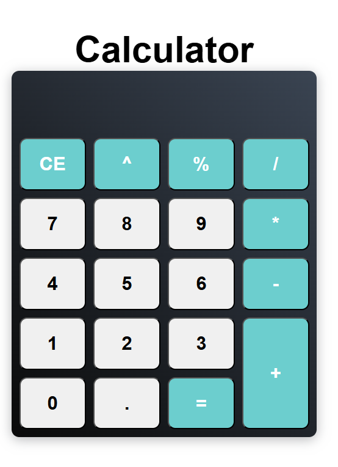

# JavaScript Calculator

A simple and interactive calculator built using HTML, CSS, and JavaScript.

## Features
- Perform basic arithmetic operations: Addition, Subtraction, Multiplication, and Division.
- User-friendly interface with responsive design.
- Supports keyboard and button input.
- Clears input with a reset button.

## Screenshot


## Technologies Used
- **HTML** for structure
- **CSS** for styling
- **JavaScript** for functionality

## Installation
1. Clone this repository:
   ```sh
   git clone https://github.com/your-username/calculator.git
   ```
2. Navigate to the project directory:
   ```sh
   cd calculator
   ```
3. Open `index.html` in your web browser.

## Usage
- Click on the number buttons to input values.
- Use the operator buttons (+, -, *, /) to perform calculations.
- Press `=` to see the result.
- Click `C` to clear the input.

## Live Demo
You can view the live demo of the calculator here:

### Deploy on GitHub Pages:
1. Push your project to a GitHub repository.
2. Go to your repository on GitHub.
3. Click on **Settings** > **Pages** (left sidebar).
4. Under **Branch**, select `main` (or `master`) and click **Save**.
5. GitHub will generate a live link (e.g., `https://your-username.github.io/calculator/`).
6. Replace the placeholder link above with the actual link.

[Live Calculator](https://your-username.github.io/calculator/)

## Contributing
1. Fork the repository.
2. Create a new branch: `git checkout -b feature-branch`
3. Make your changes and commit: `git commit -m 'Add new feature'`
4. Push to the branch: `git push origin feature-branch`
5. Submit a pull request.

## License
This project is open-source and available under the [MIT License](LICENSE).

---

Feel free to update the repository link, live demo link, and username before publishing!
